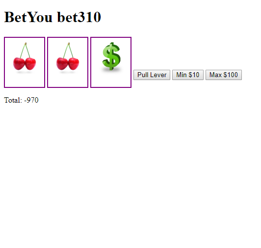

# Slot Machine
A slot machine game made with jQuery

**Link to project:** http://recruiters-love-seeing-live-demos.com/

## How It's Made:

**Tech used:** HTML, CSS, jQuery

This is a very simple slot machine application. There are three reels with five slots each. The reels are represented by empty divs and the images for each slot are stored as indexes within an array. When the use clicks the "Pull Lever" button, a function is executed the generates a random number between 0 and 5. Based upon that number, the function will change the image source of a div to a random image from the array.

<!-- ## Optimizations
Refactor CSS -->

## Lessons Learned:
Learning how to use math random and math round

<!-- **Wu Tang Name Generator:** https://tariqnaziri.github.io/wu-tang-name-generator/

**Voicebox:** https://tariqnaziri.github.io/voicebox/

**Coffee Shop** https://github.com/tariqnaziri/coffee-shop -->
